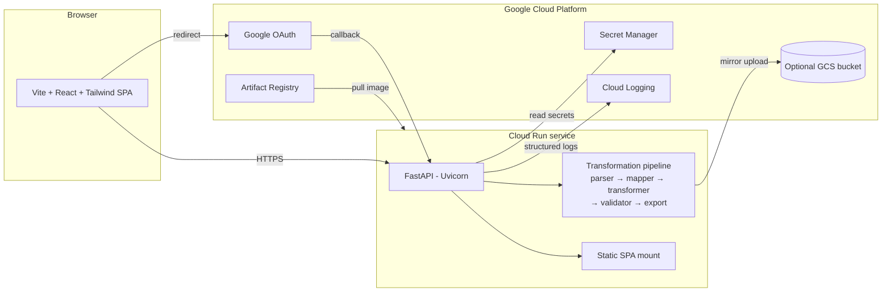
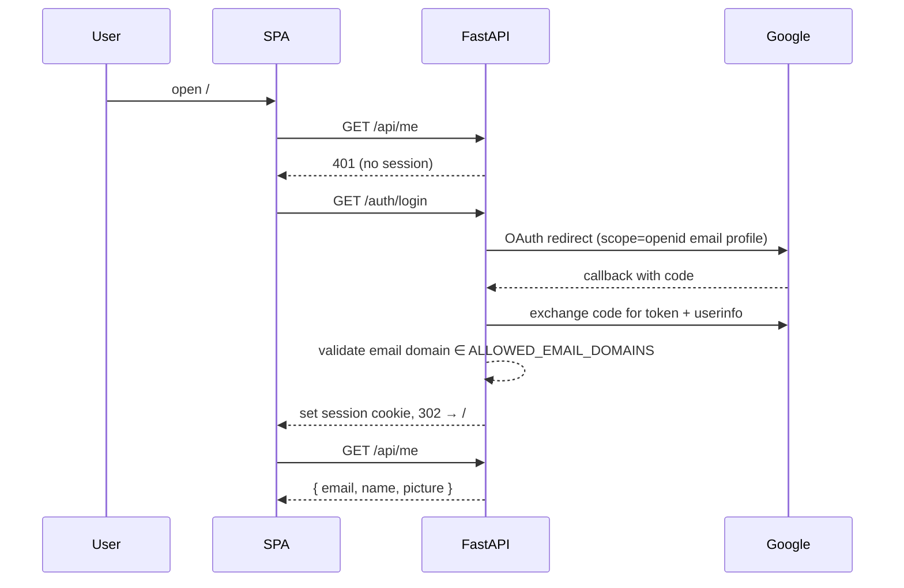
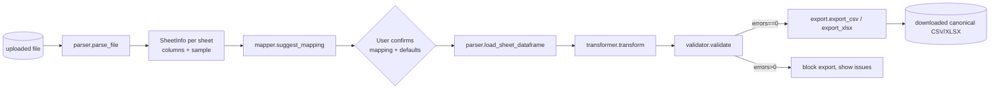
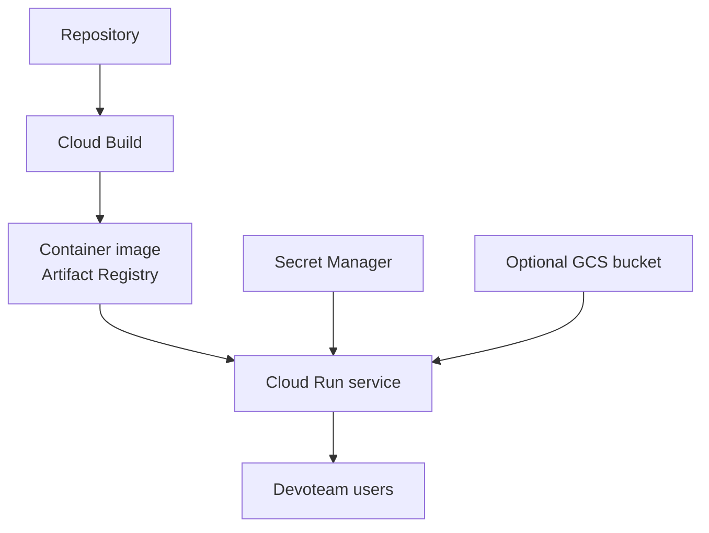

# Architecture

## High-level diagram



## Request flow

### 1. Login



### 2. Upload → Mapping → Preview → Export

```mermaid
sequenceDiagram
  participant SPA
  participant API as FastAPI
  participant Store as /tmp (or GCS)
  participant Pipe as Pipeline
  SPA->>API: POST /api/upload (file)
  API->>Store: save to /tmp + optional gs:// mirror
  API->>Pipe: parse_file → suggest_mapping
  API-->>SPA: upload_id, sheets, columns, suggested mapping (with confidence)
  SPA->>SPA: render mapping UI; user adjusts; user sets defaults
  SPA->>API: POST /api/mapping/preview {upload_id, mapping, defaults}
  API->>Store: load_sheet_dataframe(upload_id)
  API->>Pipe: transform → validate
  API-->>SPA: rows[], issues[], summary
  alt errors == 0
    SPA->>API: POST /api/export {format}
    API->>Pipe: transform → validate → export_csv|export_xlsx
    API-->>SPA: file download
  else errors > 0
    SPA->>SPA: block export, show errors panel
  end
```

## Data flow inside the pipeline



The pipeline is **pure** between `transformer.transform` and `export.*`: given
the same source DataFrame + mapping + defaults, output is byte-identical. This
makes regressions trivial to test (`backend/tests/test_export.py`).

## Security model

| Layer | Control |
| --- | --- |
| Network | Cloud Run with `--no-allow-unauthenticated` (deploy script default). |
| Identity | Google OAuth; only emails whose domain ∈ `ALLOWED_EMAIL_DOMAINS` accepted. |
| Session | `SessionMiddleware`-signed cookie. `SESSION_SECRET` from Secret Manager. |
| Upload | File extension whitelist (`.csv .xlsx .xls`) and `MAX_UPLOAD_MB` cap. |
| Parsing | Files parsed via pandas / openpyxl / xlrd — never executed. |
| Storage | Default `/tmp`, evicted after `UPLOAD_RETENTION_MINUTES`. Optional GCS mirror with bucket lifecycle policy. |
| Logs | Only metadata (upload_id, row counts, error counts, user email). No row-level content logged. |
| Secrets | OAuth + session secret loaded from Secret Manager via `--set-secrets`. |
| Runtime | Container runs as non-root `appuser`. |

### Hardening tips

- Replace OAuth-in-app with **Identity-Aware Proxy (IAP)** for centralized
  enterprise SSO and audit (`gcloud beta iap`).
- Add **VPC-SC** if uploaded data is sensitive enough to require perimeter
  enforcement.
- Add a **Cloud Armor** policy in front of the Cloud Run URL to enforce
  geo-fencing and rate limiting.

## Cloud Run deployment model



- **Build** stage 1 (Node 20) compiles the SPA into `frontend/dist`.
- **Build** stage 2 (Python 3.12) installs dependencies and copies
  `backend/`, `templates/`, and the SPA bundle.
- The container starts uvicorn bound to `$PORT` (Cloud Run requirement).
- The FastAPI app mounts `frontend/dist` at `/` so the SPA and API share an
  origin — no CORS dance and the session cookie just works.
- Cloud Run's default ephemeral filesystem stores temporary uploads in
  `/tmp` (`tmpfs`); GCS mirroring is opt-in.

### Scaling

- Defaults: `--cpu=1 --memory=1Gi --concurrency=20 --max-instances=5`. Tune
  `concurrency` and `max-instances` based on expected concurrent
  transformations.
- Set `--min-instances=1` if you want to avoid the cold-start cost of pandas
  import (~1.5s) on the first request after idle scale-to-zero.

## Future enhancements

- **Mapping profiles** — persist confirmed mappings keyed by file fingerprint /
  customer to skip the mapping step on repeat exports.
- **BigQuery export path** — write the canonical schema directly to a BQ table
  via the storage write API.
- **Audit logs** — extend the existing structured logger to also write to a
  dedicated Cloud Logging sink → BigQuery for queryable history.
- **Admin synonym management** — currently synonyms live in `mapper.py`; a tiny
  admin UI backed by Firestore would let domain experts add synonyms without
  touching code.
- **Lifecycle automation** — the deploy script could apply a 24h delete
  lifecycle to the GCS bucket automatically.
- **Multi-tenant isolation** — per-tenant prefix in GCS plus per-tenant IAM
  bindings if the tool is opened beyond a single team.
